# 🤖 AI Agents Architecture

## Agent Interaction Flow

```mermaid
sequenceDiagram
    participant User as 👨‍🌾 Farmer
    participant API as 🔥 Firebase API
    participant Router as 🤖 Agent Router
    participant Profile as 👤 Profile Agent
    participant Disease as 🦠 Disease Agent
    participant Irrigation as 💧 Irrigation Agent
    participant Market as 📈 Market Agent
    participant Scheme as 🏛️ Scheme Agent
    participant AI as 🧠 Gemini AI
    participant DB as 🗄️ Firestore
    participant Storage as ☁️ Cloud Storage

    User->>API: Voice/Text/Image Query
    API->>Router: Process Query
    Router->>Profile: Get User Context
    Profile->>DB: Fetch Profile Data
    DB-->>Profile: Return Profile
    Profile-->>Router: User Context
    
    Router->>Router: Classify Intent
    
    alt Disease Query
        Router->>Disease: Analyze Disease
        Disease->>AI: Vision + Text Analysis
        AI-->>Disease: Diagnosis Result
        Disease-->>Router: Treatment Plan
    else Irrigation Query
        Router->>Irrigation: Get Advice
        Irrigation->>AI: Generate Recommendations
        AI-->>Irrigation: Water Schedule
        Irrigation-->>Router: Irrigation Plan
    else Market Query
        Router->>Market: Price Analysis
        Market->>AI: Market Intelligence
        AI-->>Market: Price Recommendations
        Market-->>Router: Market Data
    else Scheme Query
        Router->>Scheme: Find Schemes
        Scheme->>AI: Eligibility Analysis
        AI-->>Scheme: Scheme Recommendations
        Scheme-->>Router: Eligible Schemes
    end
    
    Router->>API: Generate Audio Response
    API->>Storage: Store Audio File
    Storage-->>API: Audio URL
    API->>DB: Log Interaction
    API-->>User: Complete Response
```



## Agent Responsibilities Matrix

| Agent | Input Types | Output Types | AI Model Used | External APIs |
|-------|-------------|--------------|---------------|---------------|
| 🦠 **Disease Agent** | Image + Text | Diagnosis + Treatment | Gemini Vision | - |
| 💧 **Irrigation Agent** | Text + Profile | Schedule + Tips | Gemini Text | Weather API* |
| 📈 **Market Agent** | Text + Location | Prices + Trends | Gemini Text | Market API* |
| 🏛️ **Scheme Agent** | Profile + Query | Schemes + Eligibility | Gemini Text | Gov API* |
| 👤 **Profile Agent** | User Data | Context + History | - | Firestore |

*\* Future integration planned*

## 🦠 Disease Agent - Deep Dive

### Process Flow
1. **Image Analysis**: Uses Gemini Vision to identify visual symptoms
2. **Text Processing**: Analyzes farmer's description of symptoms
3. **Context Integration**: Considers crop type, location, and season
4. **Diagnosis Generation**: Provides specific disease identification
5. **Treatment Planning**: Suggests actionable treatment steps
6. **Cost Estimation**: Provides realistic treatment cost ranges

### Example Diagnosis Process
```typescript
// Input Processing
const symptoms = {
  visual: "Yellow spots on leaves, brown edges",
  described: "Leaves are curling and falling off",
  crop: "tomato",
  location: "Karnataka",
  season: "post-monsoon"
};

// AI Analysis
const diagnosis = await diseaseAgent.analyze({
  imageUrl: symptoms.visual,
  description: symptoms.described,
  context: userProfile
});

// Output Generation
{
  disease: "Early Blight (Alternaria solani)",
  confidence: 87,
  symptoms_matched: ["yellow spots", "brown lesions", "leaf drop"],
  treatments: [
    {
      method: "Copper-based fungicide spray",
      cost: "₹400-600",
      effectiveness: "85%",
      application: "Every 7-10 days"
    }
  ],
  prevention: [
    "Improve air circulation",
    "Avoid overhead watering",
    "Remove infected plant debris"
  ]
}
```

## 💧 Irrigation Agent - Deep Dive

### Smart Scheduling Algorithm
```typescript
interface IrrigationSchedule {
  calculateWaterNeeds(crop: string, stage: GrowthStage, weather: WeatherData): WaterRequirement;
  optimizeSchedule(soilType: string, farmSize: number): Schedule;
  adjustForWeather(baseSchedule: Schedule, forecast: WeatherForecast): Schedule;
}

// Example calculation
const waterNeeds = {
  crop: "wheat",
  stage: "flowering",
  dailyRequirement: "5mm",
  soilType: "clay",
  evapotranspiration: "4.2mm/day",
  recommendedFrequency: "every 5-7 days"
};
```

### Water Conservation Features
- **Drip irrigation** recommendations
- **Mulching** suggestions
- **Rainwater harvesting** guidance
- **Soil moisture** monitoring tips

## 📈 Market Agent - Deep Dive

### Price Analysis Framework
```typescript
interface MarketAnalysis {
  currentPrice: number;
  priceHistory: PricePoint[];
  trendAnalysis: TrendData;
  marketFactors: Factor[];
  recommendation: TradeAction;
}

// Sample analysis
{
  crop: "wheat",
  currentPrice: 2150, // per quintal
  trend: "upward",
  confidence: 78,
  factors: [
    "Monsoon delayed in neighboring states",
    "Export demand increased by 12%",
    "Storage capacity at 67%"
  ],
  recommendation: {
    action: "HOLD",
    duration: "2-3 weeks",
    expectedPrice: 2300,
    riskLevel: "medium"
  }
}
```

## 🏛️ Scheme Agent - Deep Dive

### Eligibility Engine
```typescript
class EligibilityEngine {
  checkPMKisan(profile: FarmerProfile): EligibilityResult {
    return {
      eligible: profile.landSize <= 2, // hectares
      benefit: 6000, // per year
      requirements: ["Aadhaar", "Land records", "Bank account"]
    };
  }
  
  checkRaithaBandhu(profile: FarmerProfile): EligibilityResult {
    return {
      eligible: profile.district.includes("Karnataka") && profile.landSize <= 10,
      benefit: profile.landSize * 10000, // per hectare
      requirements: ["Land records", "Aadhaar", "Bank passbook"]
    };
  }
}
```

### Scheme Database
```json
{
  "schemes": [
    {
      "id": "pm-kisan",
      "name": "PM-KISAN",
      "type": "income_support",
      "benefit": 6000,
      "frequency": "annual",
      "eligibility": {
        "landSize": {"max": 2, "unit": "hectares"},
        "category": ["small", "marginal"]
      },
      "documents": ["aadhaar", "land_records", "bank_account"],
      "applicationMode": "online",
      "processingTime": "30-45 days"
    }
  ]
}
```

## 🔧 Agent Configuration

### Model Selection Strategy
```typescript
const MODEL_PRIORITY = [
  'gemini-2.5-flash',      // Latest and fastest
  'gemini-2.5-flash-lite', // Fallback option
  'gemini-2.0-flash',      // Stable version
  'gemini-2.0-flash-lite'  // Minimal fallback
];

export const getOptimalModel = async (taskType: 'text' | 'vision'): Promise<GenerativeModel> => {
  for (const modelName of MODEL_PRIORITY) {
    try {
      const model = await initializeModel(modelName);
      console.log(`✅ Using ${modelName} for ${taskType} tasks`);
      return model;
    } catch (error) {
      console.log(`❌ ${modelName} not available, trying next...`);
      continue;
    }
  }
  throw new Error('🚨 No Gemini models available');
};
```

### Safety and Content Filtering
```typescript
const SAFETY_SETTINGS = [
  {
    category: HarmCategory.HARM_CATEGORY_HATE_SPEECH,
    threshold: HarmBlockThreshold.BLOCK_MEDIUM_AND_ABOVE,
  },
  {
    category: HarmCategory.HARM_CATEGORY_DANGEROUS_CONTENT,
    threshold: HarmBlockThreshold.BLOCK_MEDIUM_AND_ABOVE,
  },
  {
    category: HarmCategory.HARM_CATEGORY_HARASSMENT,
    threshold: HarmBlockThreshold.BLOCK_MEDIUM_AND_ABOVE,
  },
  {
    category: HarmCategory.HARM_CATEGORY_SEXUALLY_EXPLICIT,
    threshold: HarmBlockThreshold.BLOCK_MEDIUM_AND_ABOVE,
  }
];
```

## 📊 Performance Optimization

### Caching Strategy
- **Profile Data**: Cached for 1 hour
- **Scheme Information**: Cached for 24 hours
- **Market Prices**: Cached for 15 minutes
- **AI Responses**: Cached based on similarity

### Load Balancing
- **Request Routing**: Based on agent type
- **Model Selection**: Automatic fallback system
- **Error Handling**: Graceful degradation
- **Rate Limiting**: Per-user quotas

## 🔍 Monitoring and Analytics

### Agent Performance Metrics
```typescript
interface AgentMetrics {
  responseTime: number;      // Average response time
  successRate: number;       // Success percentage
  errorRate: number;         // Error percentage
  userSatisfaction: number;  // Rating out of 5
  tokensUsed: number;        // AI token consumption
}

// Example metrics
{
  "diseaseAgent": {
    "responseTime": 2.3,     // seconds
    "successRate": 94.5,     // percentage
    "errorRate": 5.5,        // percentage
    "userSatisfaction": 4.2, // out of 5
    "tokensUsed": 1250       // per request
  }
}
```

### Health Checks
- **Model Availability**: Real-time monitoring
- **API Response Times**: Performance tracking
- **Error Rates**: Threshold-based alerts
- **Resource Usage**: Memory and CPU monitoring
