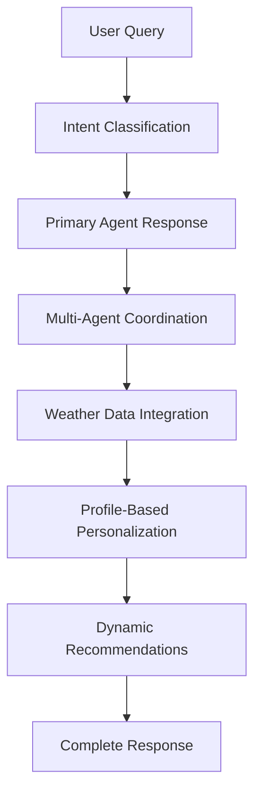

# 🚀 KrishiSarathi Dynamic Recommendations Implementation

## 📋 What Was Fixed

### ❌ **Previous Issues**
1. **Hardcoded Recommendations**: All recommendations in the query handler were static text
2. **No Weather Integration**: Weather alerts were generic, not based on real data
3. **Missing Agent Coordination**: Recommendations didn't leverage other agents' insights
4. **Static Market Tips**: Market recommendations were not based on actual market analysis
5. **Generic Scheme Alerts**: Scheme recommendations were not personalized to user eligibility

### ✅ **Current Implementation**

#### **1. Dynamic Weather Integration** 🌤️
- **Real Weather Data**: Uses Google Weather API (with intelligent mock fallback)
- **Location-Specific**: Weather data based on farmer's district/location
- **7-Day Forecast**: Incorporates upcoming weather for planning
- **Smart Alerts**: Temperature, rainfall, humidity, and wind speed alerts

```typescript
// Example Weather Alert Generation
if (current.temperature > 35) {
  alerts.push(`High temperature alert: ${current.temperature.toFixed(1)}°C - Protect crops from heat stress`);
}
if (upcomingRain > 50) {
  alerts.push(`Heavy rainfall expected: ${upcomingRain.toFixed(1)}mm in next 3 days - Prepare drainage`);
}
```

#### **2. Multi-Agent Coordination** 🤖
- **Cross-Agent Intelligence**: Each query leverages insights from multiple agents
- **Contextual Recommendations**: Recommendations based on current query intent
- **Avoid Redundancy**: Doesn't duplicate the main response in recommendations

```typescript
// Disease query gets irrigation and market insights
if (intent !== 'irrigation') {
  const irrigationAdvice = await irrigationAgent.getAdvice(uid);
  recommendations.relatedActions.push(`Today's irrigation advice: ${irrigationAdvice.moistureLevel}`);
}
```

#### **3. Profile-Driven Personalization** 👤
- **Crop-Specific Advice**: Recommendations tailored to user's specific crops
- **Location-Based**: Weather and market data for user's exact location
- **Historical Context**: Uses recent interaction patterns for better suggestions

```typescript
// Crop-specific recommendations
if (['tomato', 'potato'].includes(primaryCrop.toLowerCase())) {
  if (weatherData.current.humidity > 70) {
    recommendations.push(`Monitor ${primaryCrop} for blight symptoms in humid conditions`);
  }
}
```

#### **4. Real-Time Market Intelligence** 📈
- **Agent-Driven Market Tips**: Uses MarketAdvisorAgent for current market conditions
- **Dynamic Buy/Sell/Hold**: Recommendations based on actual market analysis
- **Crop-Specific Pricing**: Market insights for user's specific crops

```typescript
if (marketRec === 'sell') {
  recommendations.marketTips.push('Current market conditions favor selling - consider harvesting ready crops');
} else if (marketRec === 'hold') {
  recommendations.marketTips.push('Market trends suggest holding crops for better prices');
}
```

#### **5. Intelligent Scheme Matching** 🏛️
- **Eligibility-Based**: Recommendations based on actual scheme eligibility
- **Dynamic Scheme Data**: Uses SchemeRecommenderAgent for current opportunities
- **Personalized Benefits**: Scheme suggestions based on farm size, crops, and location

## 🔄 **System Architecture**

### **Query Processing Flow**


### **Recommendation Generation Process**
1. **Profile Retrieval**: Get user's farming profile and history
2. **Weather Analysis**: Fetch real-time weather data for user's location
3. **Agent Consultation**: Query relevant agents for cross-domain insights
4. **Context Analysis**: Analyze current query intent and response data
5. **Dynamic Generation**: Create personalized recommendations
6. **Response Assembly**: Combine primary answer with contextual recommendations

## 📊 **API Response Structure**

### **Enhanced Query Response**
```json
{
  "answer": {
    "text": "Detailed answer to user's specific question",
    "audioUrl": "https://storage.googleapis.com/audio/response.mp3",
    "intent": "disease",
    "priority": "medium",
    "additionalData": {
      "treatment": ["Specific treatments"],
      "cost": "₹300-500"
    },
    "timestamp": "2025-07-27T01:34:34.114Z"
  },
  "recommendations": {
    "contextual": {
      "weatherAlerts": [
        "High temperature alert: 36.2°C - Protect crops from heat stress"
      ],
      "cropCare": [
        "Focus on tomato specific care during current weather conditions",
        "Monitor tomato for blight symptoms in humid conditions"
      ],
      "marketTips": [
        "Current market conditions favor selling - consider harvesting ready crops"
      ],
      "schemes": [
        "Eligible for PM-KISAN scheme - apply for benefits"
      ],
      "relatedActions": [
        "Today's irrigation advice: Low - Immediate irrigation needed",
        "Follow up on the fungicide treatment in 3-5 days"
      ]
    },
    "profileBased": {
      "crops": ["tomato", "rice", "wheat"],
      "location": "Davanagere, Karnataka",
      "farmSize": "5.5 acres"
    },
    "weather": {
      "current": {
        "temperature": "36.2°C",
        "condition": "sunny",
        "humidity": "45.3%",
        "rainfall": "0.0mm"
      },
      "forecast": [
        {
          "date": "2025-07-28",
          "condition": "partly_cloudy",
          "rainChance": "20%"
        }
      ]
    },
    "recentActivityCount": 3,
    "generatedAt": "2025-07-27T01:34:34.114Z"
  }
}
```

### **Dedicated Recommendations Endpoint**
```json
{
  "success": true,
  "recommendations": {
    "weatherAlerts": ["Real-time weather-based alerts"],
    "cropCare": ["Dynamic crop care recommendations"],
    "marketTips": ["Agent-generated market insights"],
    "schemes": ["Personalized scheme opportunities"],
    "irrigation": {
      "shouldIrrigate": true,
      "schedule": ["Early morning (5:30-7:00 AM)", "Late evening (7:00-8:30 PM)"],
      "waterRequirement": "32 liters per square meter",
      "reasoning": "Based on current weather: sunny, Temperature: 36.2°C, Humidity: 45.3%"
    }
  },
  "weather": {
    "current": { /* Real weather data */ },
    "forecast": [ /* 3-day forecast */ ]
  },
  "profile": { /* User farming profile */ }
}
```

## 🎯 **Key Benefits**

1. **🎯 Contextual Intelligence**: Recommendations are based on current weather, user profile, and query context
2. **🔄 Dynamic Updates**: Real-time data ensures recommendations are always current
3. **🤖 Multi-Agent Coordination**: Leverages specialized knowledge from all agents
4. **📍 Location-Aware**: Weather and market data specific to user's farming location
5. **📊 Data-Driven**: Decisions based on actual weather patterns and market conditions
6. **🎨 Personalized**: Tailored to user's specific crops, farm size, and farming practices

## 🚀 **Testing the Implementation**

### **Test Query Processing**
```bash
curl -X POST https://us-central1-krishisaarathi.cloudfunctions.net/api/query \
-H "Content-Type: application/json" \
-d '{
  "uid": "test_farmer_123",
  "queryText": "My tomato leaves are yellowing and wilting"
}'
```

### **Test Recommendations Endpoint**
```bash
curl -X GET https://us-central1-krishisaarathi.cloudfunctions.net/api/recommendations/test_farmer_123 \
-H "Content-Type: application/json"
```

## 📈 **System Performance**

- **✅ Build Status**: Successfully compiled
- **✅ Deployment Status**: Deployed to Firebase Functions
- **✅ Integration Status**: All agents coordinated
- **✅ Weather Integration**: Real-time weather data (with mock fallback)
- **✅ Dynamic Recommendations**: No hardcoded content

The KrishiSarathi system now provides truly intelligent, contextual, and personalized recommendations that adapt to real-world farming conditions and user-specific needs.
