# 🧠 KrishiSarathi Multimodal Knowledge Graph

## 📊 System Architecture Knowledge Graph

```mermaid
graph TB
    %% User Input Layer
    subgraph "📱 User Input Layer"
        Voice[🗣️ Voice Input]
        Text[📝 Text Input]
        Image[📸 Image Input]
        Audio[🔊 Audio Files]
    end

    %% Processing Layer
    subgraph "🔄 Processing Services"
        STT[🎯 Speech-to-Text<br/>Google Cloud STT]
        Vision[👁️ Vision Processing<br/>Gemini Vision]
        Classifier[🧠 Intent Classifier<br/>Gemini Text]
    end

    %% Agent Layer
    subgraph "🤖 AI Agent Ecosystem"
        ProfileAgent[👤 Profile Context Agent<br/>User Data & Context]
        DiseaseAgent[🦠 Disease Diagnoser<br/>Vision + Text Analysis]
        IrrigationAgent[💧 Irrigation Advisor<br/>Weather + Soil Data]
        MarketAgent[📈 Market Advisor<br/>Price + Trend Analysis]
        SchemeAgent[🏛️ Scheme Recommender<br/>Policy + Eligibility]
        SummaryAgent[📋 Daily Summary<br/>Multi-Agent Synthesis]
    end

    %% AI Models Layer
    subgraph "🧠 Google AI Models"
        Gemini25[🚀 Gemini 2.5 Flash<br/>Primary Model]
        Gemini15[⚡ Gemini 1.5 Flash<br/>Fallback Model]
        GeminiPro[🎯 Gemini 1.5 Pro<br/>High Accuracy]
        CloudSTT[🗣️ Cloud Speech-to-Text]
        CloudTTS[🔊 Cloud Text-to-Speech]
    end

    %% Data Sources
    subgraph "📊 Data Sources"
        UserProfiles[(👤 User Profiles<br/>Firestore)]
        Interactions[(💬 Interactions<br/>History)]
        Weather[(🌤️ Weather Data<br/>External API)]
        MarketData[(💰 Market Prices<br/>External API)]
        Schemes[(📋 Gov Schemes<br/>Static Data)]
        CropData[(🌾 Crop Database<br/>Agricultural KB)]
    end

    %% Output Layer
    subgraph "📤 Response Generation"
        TextResponse[📝 Text Response]
        AudioResponse[🔊 Audio Response]
        Recommendations[🎯 Contextual<br/>Recommendations]
        Notifications[🔔 Daily<br/>Notifications]
    end

    %% Storage Layer
    subgraph "💾 Storage & Logging"
        Firestore[(🔥 Firestore<br/>NoSQL Database)]
        CloudStorage[(☁️ Cloud Storage<br/>Audio/Images)]
        Analytics[(📊 Analytics<br/>Usage Tracking)]
    end

    %% Connections - Input Processing
    Voice --> STT
    Image --> Vision
    Text --> Classifier
    Audio --> STT

    %% AI Model Connections
    STT --> CloudSTT
    Vision --> Gemini25
    Classifier --> Gemini25
    Gemini25 -.-> Gemini15
    Gemini15 -.-> GeminiPro

    %% Agent Connections
    STT --> ProfileAgent
    Vision --> DiseaseAgent
    Classifier --> ProfileAgent
    
    ProfileAgent --> DiseaseAgent
    ProfileAgent --> IrrigationAgent
    ProfileAgent --> MarketAgent
    ProfileAgent --> SchemeAgent
    ProfileAgent --> SummaryAgent

    %% Inter-Agent Communications
    DiseaseAgent -.-> SummaryAgent
    IrrigationAgent -.-> SummaryAgent
    MarketAgent -.-> SummaryAgent
    SchemeAgent -.-> SummaryAgent

    %% Data Source Connections
    UserProfiles --> ProfileAgent
    Interactions --> ProfileAgent
    Weather --> IrrigationAgent
    MarketData --> MarketAgent
    Schemes --> SchemeAgent
    CropData --> DiseaseAgent

    %% AI Model Usage by Agents
    DiseaseAgent --> Gemini25
    IrrigationAgent --> Gemini25
    MarketAgent --> Gemini25
    SchemeAgent --> Gemini25
    SummaryAgent --> Gemini25

    %% Output Generation
    DiseaseAgent --> TextResponse
    IrrigationAgent --> TextResponse
    MarketAgent --> TextResponse
    SchemeAgent --> TextResponse
    SummaryAgent --> Notifications

    TextResponse --> CloudTTS
    CloudTTS --> AudioResponse
    
    ProfileAgent --> Recommendations
    Recommendations --> TextResponse

    %% Storage Connections
    TextResponse --> Firestore
    AudioResponse --> CloudStorage
    Notifications --> Firestore
    Recommendations --> Firestore
    ProfileAgent --> Analytics

    %% Styling
    classDef inputNode fill:#e1f5fe,stroke:#01579b,stroke-width:2px
    classDef agentNode fill:#f3e5f5,stroke:#4a148c,stroke-width:2px
    classDef modelNode fill:#fff3e0,stroke:#e65100,stroke-width:2px
    classDef dataNode fill:#e8f5e8,stroke:#2e7d32,stroke-width:2px
    classDef outputNode fill:#fce4ec,stroke:#880e4f,stroke-width:2px
    classDef storageNode fill:#f1f8e9,stroke:#33691e,stroke-width:2px

    class Voice,Text,Image,Audio inputNode
    class ProfileAgent,DiseaseAgent,IrrigationAgent,MarketAgent,SchemeAgent,SummaryAgent agentNode
    class Gemini25,Gemini15,GeminiPro,CloudSTT,CloudTTS modelNode
    class UserProfiles,Interactions,Weather,MarketData,Schemes,CropData dataNode
    class TextResponse,AudioResponse,Recommendations,Notifications outputNode
    class Firestore,CloudStorage,Analytics storageNode
```

## 🔗 Agent Interaction Knowledge Graph

## 🌐 Multimodal Data Flow Graph

```mermaid
graph TD
    subgraph "📱 Input Modalities"
        VoiceIn[🗣️ Voice<br/>Multiple Languages]
        TextIn[📝 Text<br/>Kannada/English]
        ImageIn[📸 Images<br/>Crop Photos]
        LocationIn[📍 GPS<br/>Location Data]
    end

    subgraph "🔄 Preprocessing"
        VoiceProcessing[🎯 Speech Recognition<br/>Google Cloud STT]
        ImageProcessing[👁️ Image Analysis<br/>Gemini Vision API]
        TextProcessing[📝 Text Normalization<br/>Language Detection]
        LocationProcessing[🗺️ Geo-processing<br/>District/Weather Zone]
    end

    subgraph "🧠 AI Model Selection"
        ModelRouter{🎯 Model Selection}
        VisionModel[👁️ Gemini Vision<br/>Image + Text]
        TextModel[📝 Gemini Text<br/>Pure Text]
        MultiModal[🔀 Multimodal<br/>Combined Input]
    end

    subgraph "🎯 Agent Processing"
        AgentSelection{🤖 Agent Selection}
        DiseaseFlow[🦠 Disease Analysis<br/>Vision + Symptoms]
        IrrigationFlow[💧 Irrigation Planning<br/>Weather + Soil]
        MarketFlow[📈 Market Analysis<br/>Price + Trends]
        SchemeFlow[🏛️ Scheme Matching<br/>Eligibility + Benefits]
    end

    subgraph "📊 Knowledge Integration"
        ProfileContext[👤 User Profile<br/>Farming History]
        WeatherContext[🌤️ Weather Data<br/>Real-time + Forecast]
        MarketContext[💰 Market Data<br/>Live Prices]
        AgricultureKB[🌾 Agriculture KB<br/>Crop Encyclopedia]
    end

    subgraph "📤 Output Generation"
        ResponseGen[📝 Response Generation<br/>Structured Output]
        AudioGen[🔊 Audio Synthesis<br/>Text-to-Speech]
        RecommendationGen[🎯 Recommendation Engine<br/>Contextual Suggestions]
        NotificationGen[🔔 Notification System<br/>Daily Summaries]
    end

    subgraph "💾 Storage & Learning"
        InteractionStore[(💬 Interaction History)]
        ProfileStore[(👤 Profile Updates)]
        FeedbackStore[(📊 Feedback Data)]
        ModelImprovement[🧠 Continuous Learning]
    end

    %% Input Processing
    VoiceIn --> VoiceProcessing
    TextIn --> TextProcessing
    ImageIn --> ImageProcessing
    LocationIn --> LocationProcessing

    %% Model Selection
    VoiceProcessing --> ModelRouter
    TextProcessing --> ModelRouter
    ImageProcessing --> ModelRouter
    LocationProcessing --> ModelRouter

    ModelRouter -->|Text Only| TextModel
    ModelRouter -->|Image + Text| VisionModel
    ModelRouter -->|Complex Query| MultiModal

    %% Agent Processing
    TextModel --> AgentSelection
    VisionModel --> AgentSelection
    MultiModal --> AgentSelection

    AgentSelection -->|Disease/Pest| DiseaseFlow
    AgentSelection -->|Irrigation| IrrigationFlow
    AgentSelection -->|Market| MarketFlow
    AgentSelection -->|Schemes| SchemeFlow

    %% Knowledge Integration
    ProfileContext --> DiseaseFlow
    ProfileContext --> IrrigationFlow
    ProfileContext --> MarketFlow
    ProfileContext --> SchemeFlow

    WeatherContext --> IrrigationFlow
    MarketContext --> MarketFlow
    AgricultureKB --> DiseaseFlow

    %% Output Generation
    DiseaseFlow --> ResponseGen
    IrrigationFlow --> ResponseGen
    MarketFlow --> ResponseGen
    SchemeFlow --> ResponseGen

    ResponseGen --> AudioGen
    ResponseGen --> RecommendationGen
    ProfileContext --> NotificationGen

    %% Storage and Learning
    ResponseGen --> InteractionStore
    RecommendationGen --> ProfileStore
    AudioGen --> FeedbackStore
    NotificationGen --> FeedbackStore

    InteractionStore --> ModelImprovement
    ProfileStore --> ModelImprovement
    FeedbackStore --> ModelImprovement
    ModelImprovement --> ProfileContext

    %% Styling
    classDef inputStyle fill:#e1f5fe,stroke:#0277bd,stroke-width:2px
    classDef processStyle fill:#f3e5f5,stroke:#7b1fa2,stroke-width:2px
    classDef modelStyle fill:#fff3e0,stroke:#f57c00,stroke-width:2px
    classDef agentStyle fill:#e8f5e8,stroke:#388e3c,stroke-width:2px
    classDef knowledgeStyle fill:#fce4ec,stroke:#c2185b,stroke-width:2px
    classDef outputStyle fill:#f1f8e9,stroke:#689f38,stroke-width:2px
    classDef storageStyle fill:#fff8e1,stroke:#ffa000,stroke-width:2px

    class VoiceIn,TextIn,ImageIn,LocationIn inputStyle
    class VoiceProcessing,ImageProcessing,TextProcessing,LocationProcessing processStyle
    class ModelRouter,VisionModel,TextModel,MultiModal modelStyle
    class AgentSelection,DiseaseFlow,IrrigationFlow,MarketFlow,SchemeFlow agentStyle
    class ProfileContext,WeatherContext,MarketContext,AgricultureKB knowledgeStyle
    class ResponseGen,AudioGen,RecommendationGen,NotificationGen outputStyle
    class InteractionStore,ProfileStore,FeedbackStore,ModelImprovement storageStyle
```

## 🎯 Agent Specialization Matrix

```mermaid
graph LR
    subgraph "🦠 Disease Agent Capabilities"
        DiseaseVision[👁️ Vision Analysis<br/>Leaf Diseases, Pest ID]
        DiseaseSymptoms[📝 Symptom Analysis<br/>Text Description]
        DiseaseTreatment[💊 Treatment Planning<br/>Chemical/Organic]
        DiseaseCost[💰 Cost Estimation<br/>Treatment Budget]
    end

    subgraph "💧 Irrigation Agent Capabilities"
        IrrigationWeather[🌤️ Weather Integration<br/>Forecast Analysis]
        IrrigationSoil[🌱 Soil Analysis<br/>Moisture & Type]
        IrrigationSchedule[⏰ Schedule Planning<br/>Optimal Timing]
        IrrigationEfficiency[⚡ Efficiency Tips<br/>Water Conservation]
    end

    subgraph "📈 Market Agent Capabilities"
        MarketPrices[💰 Price Tracking<br/>Real-time Data]
        MarketTrends[📊 Trend Analysis<br/>Historical Patterns]
        MarketTiming[⏱️ Sell/Hold Advice<br/>Optimal Timing]
        MarketLogistics[🚛 Logistics Planning<br/>Transport & Storage]
    end

    subgraph "🏛️ Scheme Agent Capabilities"
        SchemeEligibility[✅ Eligibility Check<br/>Profile Matching]
        SchemeApplication[📋 Application Guide<br/>Step-by-step]
        SchemeBenefits[💎 Benefit Calculation<br/>Expected Returns]
        SchemeDeadlines[⏰ Deadline Tracking<br/>Important Dates]
    end

    subgraph "📋 Summary Agent Capabilities"
        SummaryIntegration[🔗 Multi-Agent Sync<br/>Data Aggregation]
        SummaryPrioritization[🎯 Task Prioritization<br/>Urgency Ranking]
        SummaryPersonalization[👤 Personal Touch<br/>User-specific Content]
        SummaryScheduling[📅 Daily Planning<br/>Action Items]
    end

    subgraph "👤 Profile Agent Capabilities"
        ProfileManagement[📊 Data Management<br/>User Information]
        ProfileContext[🎯 Context Generation<br/>Personalized Prompts]
        ProfileLearning[🧠 Behavior Learning<br/>Preference Tracking]
        ProfileRecommendations[💡 Suggestion Engine<br/>Proactive Advice]
    end

    %% Cross-agent relationships
    DiseaseVision -.-> SummaryIntegration
    IrrigationSchedule -.-> SummaryScheduling
    MarketTiming -.-> SummaryPrioritization
    SchemeDeadlines -.-> SummaryScheduling
    
    ProfileContext --> DiseaseSymptoms
    ProfileContext --> IrrigationSoil
    ProfileContext --> MarketPrices
    ProfileContext --> SchemeEligibility
    
    ProfileLearning <--> SummaryPersonalization

    %% Styling
    classDef diseaseStyle fill:#ffebee,stroke:#c62828,stroke-width:2px
    classDef irrigationStyle fill:#e3f2fd,stroke:#1565c0,stroke-width:2px
    classDef marketStyle fill:#e8f5e8,stroke:#2e7d32,stroke-width:2px
    classDef schemeStyle fill:#fff3e0,stroke:#ef6c00,stroke-width:2px
    classDef summaryStyle fill:#f3e5f5,stroke:#7b1fa2,stroke-width:2px
    classDef profileStyle fill:#fce4ec,stroke:#ad1457,stroke-width:2px

    class DiseaseVision,DiseaseSymptoms,DiseaseTreatment,DiseaseCost diseaseStyle
    class IrrigationWeather,IrrigationSoil,IrrigationSchedule,IrrigationEfficiency irrigationStyle
    class MarketPrices,MarketTrends,MarketTiming,MarketLogistics marketStyle
    class SchemeEligibility,SchemeApplication,SchemeBenefits,SchemeDeadlines schemeStyle
    class SummaryIntegration,SummaryPrioritization,SummaryPersonalization,SummaryScheduling summaryStyle
    class ProfileManagement,ProfileContext,ProfileLearning,ProfileRecommendations profileStyle
```

## 🔄 Continuous Learning Knowledge Graph

```mermaid
graph TB
    subgraph "📊 Data Collection"
        UserInteractions[💬 User Interactions<br/>Query-Response Pairs]
        UserFeedback[👍 User Feedback<br/>Ratings & Comments]
        AgentPerformance[📈 Agent Performance<br/>Success Metrics]
        ContextualData[🎯 Contextual Data<br/>Profile & Environment]
    end

    subgraph "🧠 Learning Mechanisms"
        PatternRecognition[🔍 Pattern Recognition<br/>Query Patterns]
        ResponseOptimization[⚡ Response Optimization<br/>Quality Improvement]
        PersonalizationLearning[👤 Personalization<br/>User Preferences]
        DomainKnowledge[📚 Domain Learning<br/>Agricultural Insights]
    end

    subgraph "🎯 Model Improvement"
        PromptEngineering[📝 Prompt Engineering<br/>Better Instructions]
        ContextEnhancement[🔗 Context Enhancement<br/>Richer Backgrounds]
        AgentSpecialization[🎯 Agent Specialization<br/>Domain Expertise]
        CrossAgentSync[🔄 Cross-Agent Sync<br/>Knowledge Sharing]
    end

    subgraph "📊 Performance Monitoring"
        AccuracyMetrics[🎯 Accuracy Tracking<br/>Response Quality]
        UserSatisfaction[😊 Satisfaction Scores<br/>User Ratings]
        ResponseTime[⏱️ Response Time<br/>Performance Speed]
        AgentUtilization[📊 Agent Usage<br/>Load Distribution]
    end

    subgraph "🔄 Feedback Loop"
        ModelUpdates[🔄 Model Updates<br/>Continuous Improvement]
        AgentRefinement[⚡ Agent Refinement<br/>Capability Enhancement]
        SystemOptimization[🚀 System Optimization<br/>Overall Performance]
        UserExperience[✨ UX Enhancement<br/>Interface Improvements]
    end

    %% Data Flow
    UserInteractions --> PatternRecognition
    UserFeedback --> ResponseOptimization
    AgentPerformance --> PersonalizationLearning
    ContextualData --> DomainKnowledge

    %% Learning to Improvement
    PatternRecognition --> PromptEngineering
    ResponseOptimization --> ContextEnhancement
    PersonalizationLearning --> AgentSpecialization
    DomainKnowledge --> CrossAgentSync

    %% Improvement to Monitoring
    PromptEngineering --> AccuracyMetrics
    ContextEnhancement --> UserSatisfaction
    AgentSpecialization --> ResponseTime
    CrossAgentSync --> AgentUtilization

    %% Monitoring to Feedback
    AccuracyMetrics --> ModelUpdates
    UserSatisfaction --> AgentRefinement
    ResponseTime --> SystemOptimization
    AgentUtilization --> UserExperience

    %% Feedback Loop Back to Collection
    ModelUpdates --> UserInteractions
    AgentRefinement --> UserFeedback
    SystemOptimization --> AgentPerformance
    UserExperience --> ContextualData

    %% Styling
    classDef dataStyle fill:#e1f5fe,stroke:#0277bd,stroke-width:2px
    classDef learningStyle fill:#f3e5f5,stroke:#7b1fa2,stroke-width:2px
    classDef improveStyle fill:#e8f5e8,stroke:#388e3c,stroke-width:2px
    classDef monitorStyle fill:#fff3e0,stroke:#f57c00,stroke-width:2px
    classDef feedbackStyle fill:#fce4ec,stroke:#c2185b,stroke-width:2px

    class UserInteractions,UserFeedback,AgentPerformance,ContextualData dataStyle
    class PatternRecognition,ResponseOptimization,PersonalizationLearning,DomainKnowledge learningStyle
    class PromptEngineering,ContextEnhancement,AgentSpecialization,CrossAgentSync improveStyle
    class AccuracyMetrics,UserSatisfaction,ResponseTime,AgentUtilization monitorStyle
    class ModelUpdates,AgentRefinement,SystemOptimization,UserExperience feedbackStyle
```

## 📋 Knowledge Graph Summary

### 🎯 **Key Insights from the Knowledge Graph**

1. **🔗 Interconnected Architecture**: All agents are interconnected through the Profile Context Agent, ensuring consistent personalization across all interactions.

2. **🔄 Multimodal Processing**: The system seamlessly handles voice, text, images, and location data through specialized preprocessing pipelines.

3. **🧠 Intelligent Routing**: The intent classifier and model router ensure optimal resource utilization by directing queries to the most appropriate agents and models.

4. **📊 Continuous Learning**: The system implements multiple feedback loops for continuous improvement at the individual agent level and system-wide optimization.

5. **🎯 Context-Aware Responses**: Every response is enhanced with contextual recommendations based on user profile, historical interactions, and real-time data.

### 🚀 **Architecture Benefits**

- **Scalability**: Modular agent design allows for easy addition of new capabilities
- **Reliability**: Multi-model fallback system ensures consistent service availability
- **Personalization**: Deep user profiling enables highly targeted recommendations
- **Efficiency**: Specialized agents reduce computational overhead and improve response quality
- **Adaptability**: Continuous learning mechanisms enable the system to evolve with user needs

This multimodal knowledge graph demonstrates how KrishiSarathi creates a comprehensive AI ecosystem that transforms traditional farming into an intelligent, data-driven agricultural practice.
