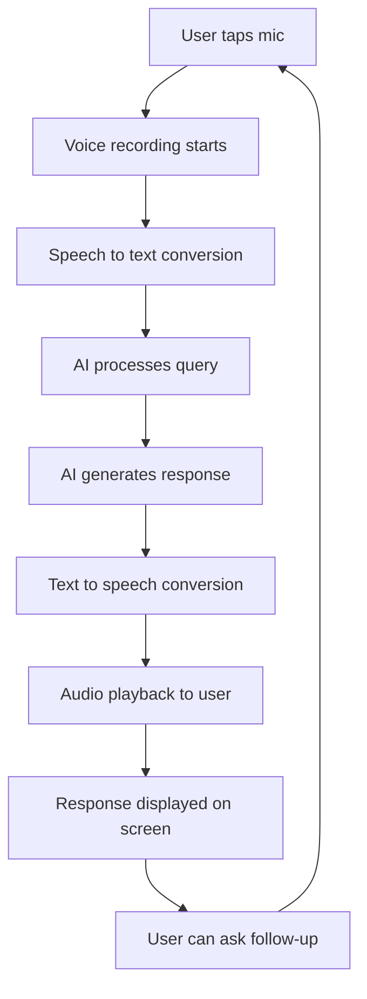
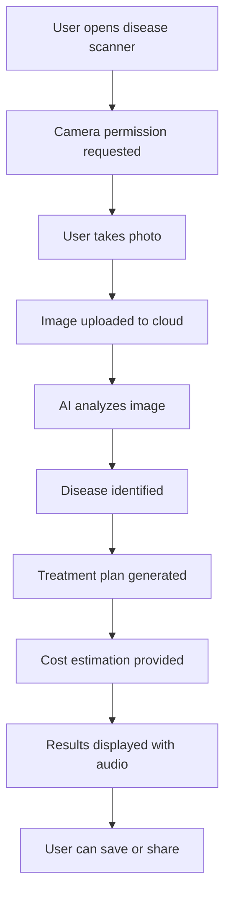

# 📱 KrishiSarathi User Interface Mockups

## 🎨 Design System

### Color Palette
- **Primary Green**: `#4CAF50` - Agriculture, growth
- **Secondary Brown**: `#8D6E63` - Earth, soil
- **Accent Orange**: `#FF9800` - Energy, warmth
- **Success Green**: `#2E7D32` - Positive actions
- **Warning Amber**: `#F57C00` - Alerts, caution
- **Error Red**: `#D32F2F` - Critical issues
- **Background**: `#F5F5F5` - Clean, neutral

### Typography
- **Headers**: Poppins Bold
- **Body**: Roboto Regular
- **UI Elements**: Inter Medium

## 📱 Mobile App Screens

### 1. 🏠 Home Dashboard
```
┌─────────────────────────────────────┐
│ 🌾 KrishiSarathi        🔔 👤     │
├─────────────────────────────────────┤
│                                     │
│  Welcome back, Ramesh! 👋           │
│  📍 Davanagere, Karnataka           │
│                                     │
│  ┌─── Quick Actions ───┐            │
│  │                     │            │
│  │ 🦠 Disease  💧 Water │            │
│  │ Scan       Schedule │            │
│  │                     │            │
│  │ 📈 Market   🏛️ Schemes│           │
│  │ Prices     & Loans  │            │
│  └─────────────────────┘            │
│                                     │
│  🎤 [Tap to speak your question]    │
│                                     │
│  📊 Today's Insights                │
│  • Weather: 28°C, Partly Cloudy    │
│  • Soil Moisture: 65% (Good)       │
│  • Market Alert: Wheat +₹50        │
│                                     │
└─────────────────────────────────────┘
```

### 2. 🦠 Disease Detection Screen
```
┌─────────────────────────────────────┐
│ ← Disease Detection                 │
├─────────────────────────────────────┤
│                                     │
│  📸 Capture Plant Image             │
│  ┌─────────────────────┐             │
│  │                     │             │
│  │     [Camera View]   │             │
│  │                     │             │
│  │     📷 Capture      │             │
│  └─────────────────────┘             │
│                                     │
│  OR                                 │
│                                     │
│  🎤 Describe the symptoms:          │
│  ┌─────────────────────────────────┐ │
│  │ "My tomato leaves are turning   │ │
│  │  yellow with brown spots..."    │ │
│  └─────────────────────────────────┘ │
│                                     │
│  🌱 Select Crop Type:               │
│  [Tomato] [Wheat] [Rice] [Other]    │
│                                     │
│        [🔍 Analyze Disease]         │
│                                     │
└─────────────────────────────────────┘
```

### 3. 💧 Irrigation Advisor Screen
```
┌─────────────────────────────────────┐
│ ← Irrigation Schedule               │
├─────────────────────────────────────┤
│                                     │
│  📅 This Week's Schedule            │
│                                     │
│  Monday    ✅ Watered (6 AM)        │
│  Tuesday   - Rest Day               │
│  Wednesday ⏰ Water Today (6 AM)     │
│  Thursday  - Check soil moisture    │
│  Friday    💧 Water (6 AM)          │
│  Saturday  - Rest Day               │
│  Sunday    💧 Water (6 AM)          │
│                                     │
│  💧 Water Recommendations           │
│  ┌─────────────────────────────────┐ │
│  │ Wheat Field - Block A           │ │
│  │ • Next watering: Tomorrow 6 AM  │ │
│  │ • Amount: 25mm                  │ │
│  │ • Duration: 2 hours             │ │
│  │ • Soil moisture: 45% (Low)      │ │
│  └─────────────────────────────────┘ │
│                                     │
│  🌦️ Weather Impact                  │
│  Rain expected tomorrow - Skip      │
│  watering and reschedule           │
│                                     │
└─────────────────────────────────────┘
```

### 4. 📈 Market Intelligence Screen
```
┌─────────────────────────────────────┐
│ ← Market Prices                     │
├─────────────────────────────────────┤
│                                     │
│  📊 Your Crops Performance          │
│                                     │
│  🌾 Wheat      ₹2,150/quintal  ↗️   │
│  Current: ₹2,150 (+₹50 today)      │
│  Recommendation: HOLD (2 weeks)     │
│  Expected: ₹2,300                   │
│                                     │
│  🍚 Rice       ₹1,850/quintal  ↘️   │
│  Current: ₹1,850 (-₹25 today)      │
│  Recommendation: SELL NOW           │
│  Trend: Declining                   │
│                                     │
│  🍅 Tomato     ₹25/kg          ↗️   │
│  Current: ₹25 (+₹3 today)          │
│  Recommendation: HOLD (1 week)      │
│  Peak season approaching            │
│                                     │
│  📍 Nearby Markets                  │
│  • APMC Davanagere (8 km)          │
│  • Harihar Market (15 km)          │
│  • Chitradurga Mandi (25 km)       │
│                                     │
└─────────────────────────────────────┘
```

### 5. 🏛️ Government Schemes Screen
```
┌─────────────────────────────────────┐
│ ← Government Schemes                │
├─────────────────────────────────────┤
│                                     │
│  ✅ Eligible Schemes for You        │
│                                     │
│  🎯 PM-KISAN                        │
│  ₹6,000/year • Next: ₹2,000 (Oct)  │
│  Status: ✅ Enrolled                │
│  [View Details]                     │
│                                     │
│  🎯 Raitha Bandhu                   │
│  ₹35,000 (3.5 hectares)            │
│  Status: 📝 Apply Now               │
│  Deadline: 15 days left             │
│  [Apply Now]                        │
│                                     │
│  🎯 Soil Health Card                │
│  Free soil testing                  │
│  Status: ⏳ Result pending          │
│  Expected: 5 days                   │
│  [Check Status]                     │
│                                     │
│  📋 Required Documents              │
│  ✅ Aadhaar Card                    │
│  ✅ Land Records                    │
│  ⚠️ Bank Passbook (Update needed)   │
│                                     │
└─────────────────────────────────────┘
```

### 6. 🎤 Voice Interaction Screen
```
┌─────────────────────────────────────┐
│ 🎤 Voice Assistant                  │
├─────────────────────────────────────┤
│                                     │
│       🌾 Listening...               │
│                                     │
│    ┌─────────────────────┐          │
│    │    ~~~~~~~~~~~      │          │
│    │  ~~~Audio Wave~~~   │          │
│    │    ~~~~~~~~~~~      │          │
│    └─────────────────────┘          │
│                                     │
│  🗣️ "Mere tamatar ke patte         │
│      peele ho rahe hain..."         │
│                                     │
│  🤖 AI is analyzing...              │
│                                     │
│  💭 I understand you're asking      │
│      about yellow tomato leaves.    │
│      Let me analyze this for you... │
│                                     │
│  Languages: 🇮🇳 हिंदी | 🇬🇧 English    │
│                                     │
│        [🛑 Stop] [🔄 Repeat]        │
│                                     │
└─────────────────────────────────────┘
```

### 7. 📊 AI Response Screen
```
┌─────────────────────────────────────┐
│ ← AI Analysis Result                │
├─────────────────────────────────────┤
│                                     │
│  🦠 Disease Detected: Early Blight  │
│  Confidence: 87%                    │
│                                     │
│  📋 Analysis Summary                │
│  • Yellowing leaves with brown spots│
│  • Fungal infection (Alternaria)    │
│  • Severity: Medium                 │
│  • Action needed within 3 days      │
│                                     │
│  💊 Treatment Plan                  │
│  1. Copper fungicide spray          │
│     💰 Cost: ₹400-600               │
│     ⏰ Apply every 7 days           │
│                                     │
│  2. Remove affected leaves          │
│     💰 Cost: Labor only             │
│     ⏰ Do immediately               │
│                                     │
│  3. Improve air circulation         │
│     💰 Cost: ₹200-300               │
│     ⏰ This week                    │
│                                     │
│  🔊 [Play Audio Response]           │
│  📤 [Share with Expert]             │
│  💾 [Save to History]               │
│                                     │
└─────────────────────────────────────┘
```

## 🌐 Web Dashboard

### Desktop View
```
┌─────────────────────────────────────────────────────────────────────────────┐
│ 🌾 KrishiSarathi                                    🔔 📊 ⚙️ 👤 Ramesh Kumar │
├─────────────────────────────────────────────────────────────────────────────┤
│                                                                             │
│ ┌─── Farm Overview ────┐  ┌─── Quick Actions ───┐  ┌─── Today's Alerts ──┐ │
│ │                      │  │                     │  │                     │ │
│ │ 📍 Davanagere, KA    │  │ 🦠 Disease Scan     │  │ ⚠️ Water wheat crop │ │
│ │ 🌡️ 28°C, Cloudy      │  │ 💧 Irrigation Plan  │  │ 📈 Wheat price ↗️   │ │
│ │ 💧 Soil: 65% moisture│  │ 📈 Market Check     │  │ 📋 Scheme deadline  │ │
│ │ 🌱 5 crops active    │  │ 🏛️ Schemes & Loans │  │                     │ │
│ │                      │  │                     │  │                     │ │
│ └──────────────────────┘  └─────────────────────┘  └─────────────────────┘ │
│                                                                             │
│ ┌─────────────────── Chat Interface ──────────────────────────────────────┐ │
│ │                                                                         │ │
│ │ 👤 What's wrong with my tomato plants? They have yellow spots.         │ │
│ │                                                                         │ │
│ │ 🤖 Based on your description, this appears to be Early Blight, a       │ │
│ │    common fungal disease. Here's my recommendation:                     │ │
│ │                                                                         │ │
│ │    💊 Treatment:                                                        │ │
│ │    • Apply copper-based fungicide spray                                │ │
│ │    • Remove infected leaves immediately                                 │ │
│ │    • Improve air circulation around plants                             │ │
│ │                                                                         │ │
│ │    💰 Estimated cost: ₹400-600                                          │ │
│ │    ⏰ Start treatment within 2-3 days                                   │ │
│ │                                                                         │ │
│ │ ┌─────────────────────────────────────────────────────────────────────┐ │ │
│ │ │ 🎤 Speak your question...                             [📤 Send]    │ │ │
│ │ └─────────────────────────────────────────────────────────────────────┘ │ │
│ └─────────────────────────────────────────────────────────────────────────┘ │
│                                                                             │
│ ┌─── Market Trends ────┐  ┌─── Irrigation Status ─┐  ┌─── Scheme Status ─┐ │
│ │                      │  │                       │  │                   │ │
│ │ 🌾 Wheat: ₹2,150 ↗️  │  │ 💧 Next: Tomorrow 6AM │  │ ✅ PM-KISAN       │ │
│ │ 🍚 Rice: ₹1,850 ↘️   │  │ 📊 Block A: 45%       │  │ 📝 Raitha Bandhu │ │
│ │ 🍅 Tomato: ₹25 ↗️    │  │ 📊 Block B: 70%       │  │ ⏳ Soil Health    │ │
│ │                      │  │ 🌧️ Rain expected      │  │                   │ │
│ │                      │  │                       │  │                   │ │
│ └──────────────────────┘  └───────────────────────┘  └───────────────────┘ │
│                                                                             │
└─────────────────────────────────────────────────────────────────────────────┘
```

## 🎨 UI Component Library

### Buttons
```css
/* Primary Button */
.btn-primary {
  background: linear-gradient(135deg, #4CAF50 0%, #45a049 100%);
  color: white;
  border-radius: 12px;
  padding: 12px 24px;
  font-weight: 600;
  box-shadow: 0 4px 12px rgba(76, 175, 80, 0.3);
}

/* Voice Button */
.btn-voice {
  background: linear-gradient(135deg, #FF9800 0%, #F57C00 100%);
  border-radius: 50%;
  width: 64px;
  height: 64px;
  box-shadow: 0 6px 20px rgba(255, 152, 0, 0.4);
}
```

### Cards
```css
/* Agent Card */
.agent-card {
  background: white;
  border-radius: 16px;
  padding: 20px;
  box-shadow: 0 8px 24px rgba(0, 0, 0, 0.1);
  border-left: 4px solid #4CAF50;
  transition: transform 0.2s ease;
}

.agent-card:hover {
  transform: translateY(-4px);
  box-shadow: 0 12px 32px rgba(0, 0, 0, 0.15);
}
```

### Status Indicators
```css
/* Health Status */
.status-healthy { color: #4CAF50; }
.status-warning { color: #FF9800; }
.status-critical { color: #F44336; }

/* Progress Indicators */
.progress-bar {
  height: 8px;
  border-radius: 4px;
  background: linear-gradient(90deg, #4CAF50 0%, #8BC34A 100%);
}
```

## 📱 Responsive Design

### Mobile First Approach
- **Breakpoints**: 
  - Mobile: 320px-768px
  - Tablet: 768px-1024px  
  - Desktop: 1024px+

### Touch-Friendly Design
- **Minimum tap targets**: 44px x 44px
- **Spacing**: 16px grid system
- **Typography**: Scalable font sizes

### Accessibility Features
- **High contrast mode**: WCAG AA compliant
- **Voice navigation**: Full voice interaction
- **Screen reader support**: Semantic HTML
- **Keyboard navigation**: Tab-friendly interface

## 🎯 User Experience Flow

### Voice Interaction Flow


### Disease Detection Flow


## 🚀 Interactive Prototypes

### Figma Prototypes
- **Mobile App**: [View Prototype](https://figma.com/krishisarathi-mobile)
- **Web Dashboard**: [View Prototype](https://figma.com/krishisarathi-web)
- **Admin Panel**: [View Prototype](https://figma.com/krishisarathi-admin)

### Video Demos
- **Voice Interaction Demo**: [Watch Demo](https://youtube.com/krishisarathi-voice)
- **Disease Detection Demo**: [Watch Demo](https://youtube.com/krishisarathi-disease)
- **Complete User Journey**: [Watch Demo](https://youtube.com/krishisarathi-journey)

---

**📱 The KrishiSarathi UI is designed to be intuitive, accessible, and farmer-friendly, ensuring that technology serves agriculture in the most human way possible.** 🌾
